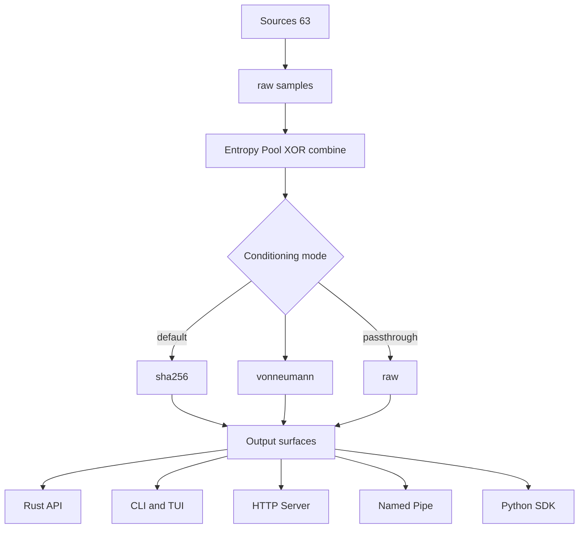

<div align="center">


# openentropy

**Harvest real entropy from hardware noise. Study it raw or condition it for crypto.**

[](https://crates.io/crates/openentropy-core)
[](https://docs.rs/openentropy-core)
[](LICENSE)
[](https://github.com/amenti-labs/openentropy/actions)
[]()

*63 entropy sources from the physics inside your computer — clock jitter, thermal noise, DRAM timing, cache contention, GPU scheduling, IPC latency, and more. Conditioned output for cryptography. Raw output for research.*

**Built for Apple Silicon. No special hardware. No API keys. Just physics.**

**By [Amenti Labs](https://github.com/amenti-labs)**

</div>

---

## Quick Start

```bash
# Install
cargo install openentropy-cli

# Discover entropy sources on your machine
openentropy scan

# Benchmark all fast sources
openentropy bench

# Output 64 random hex bytes
openentropy stream --format hex --bytes 64

# Live TUI dashboard
openentropy monitor
```

> By default, only fast sources (<2s) are used. Pass `all` as a positional argument to include slower sources (DNS, TCP, GPU, BLE).

### Python

```bash
pip install openentropy
```

```python
from openentropy import EntropyPool, detect_available_sources

sources = detect_available_sources()
print(f"{len(sources)} entropy sources available")

pool = EntropyPool.auto()
data = pool.get_random_bytes(256)
```

Build from source (native extension):

```bash
git clone https://github.com/amenti-labs/openentropy.git && cd openentropy
pip install maturin
maturin develop
```

---

## Two Audiences

**Security engineers** use OpenEntropy to validate entropy quality and seed CSPRNGs:
```bash
openentropy analyze --profile security --output audit.md
```

**Researchers** use OpenEntropy to study raw noise characteristics:
```bash
openentropy analyze --profile deep --output analysis.json
```

Security engineers seed CSPRNGs, generate keys, and supplement `/dev/urandom` with independent hardware entropy. The SHA-256 conditioned output (`--conditioning sha256`, the default) produces cryptographic-quality random bytes. The `security` profile enables the NIST test battery, min-entropy breakdown, and SHA-256 conditioning in one flag.

Researchers study the raw noise characteristics of hardware subsystems. Pass `--conditioning raw` to get unwhitened, unconditioned bytes that preserve the actual noise signal from each source. The `deep` profile enables 100K samples, cross-correlation, and PEAR-style trial analysis.

Raw mode enables:
- **Hardware characterization** — measure min-entropy, autocorrelation, and spectral properties of individual noise sources
- **Silicon validation** — compare noise profiles across chip revisions, thermal states, and voltage domains
- **Anomaly detection** — monitor entropy source health for signs of hardware degradation or tampering
- **Cross-domain analysis** — study correlations between independent entropy domains (thermal vs timing vs IPC)

---

## What Makes This Different

Most random number generators are **pseudorandom** — deterministic algorithms seeded once. OpenEntropy continuously harvests **real physical noise** from your hardware:

- **Thermal noise** — three independent oscillator beats (CPU crystal vs audio PLL, display PLL, PCIe PHY PLLs)
- **Timing and microarchitecture** — clock phase noise, DRAM row buffer conflicts, speculative execution variance, TLB shootdowns, DVFS races, ICC bus contention, prefetcher state, APRR JIT timing, ANE clock domain crossing
- **I/O and IPC** — disk and NVMe latency (including IOKit sensor polling, raw device, and Linux passthrough), USB enumeration, Mach port IPC, pipe buffer allocation, kqueue events, fsync journal
- **GPU and compute** — GPU warp divergence, IOSurface cross-domain timing, Neural Engine inference timing
- **Scheduling and system** — nanosleep drift, GCD dispatch queues, thread lifecycle, P/E-core migration, timer coalescing, kernel counters, process table snapshots
- **Network and sensors** — DNS resolution timing, TCP handshake variance, WiFi RSSI, BLE ambient RF, audio ADC noise
- **Deep hardware** — dual clock domain beats, SITVA, AES-XTS context switching, SEV broadcast, COMMPAGE seqlock, SMC thermistor, getentropy TRNG reseed

The pool XOR-combines independent streams. No single source failure can compromise the pool.

### Conditioning Modes

Conditioning is **optional and configurable**. Use `--conditioning` on the CLI or `?conditioning=` on the HTTP API:

| Mode | Flag | Description |
|------|------|-------------|
| **SHA-256** (default) | `--conditioning sha256` | SHA-256 conditioning. Cryptographic quality output. |
| **Von Neumann** | `--conditioning vonneumann` | Debiasing only — removes bias while preserving more of the raw signal structure. |
| **Raw** | `--conditioning raw` | No processing. Source bytes with zero whitening — preserves the actual hardware noise signal for research. |

Raw mode is what makes OpenEntropy useful for research. Most HWRNG APIs run DRBG post-processing that makes every source look like uniform random bytes, destroying the information researchers need. Raw output preserves per-source noise structure: bias, autocorrelation, spectral features, and cross-source correlations. See [Conditioning](docs/CONDITIONING.md) for details.

---

## Documentation

| Doc | Description |
|-----|-------------|
| [Source Catalog](docs/SOURCES.md) | All 63 entropy sources with physics explanations |
| [CLI Reference](docs/CLI.md) | Full command reference and examples |
| [Conditioning](docs/CONDITIONING.md) | Raw vs VonNeumann vs SHA-256 conditioning modes |
| [Trial Analysis Methodology](docs/TRIALS.md) | PEAR-style 200-bit trials, calibration gate, and references |
| [Telemetry Model](docs/TELEMETRY.md) | Experimental telemetry_v1 context model and integration points |
| [API Reference](docs/API.md) | HTTP server endpoints and response formats |
| [Architecture](docs/ARCHITECTURE.md) | Crate structure and design decisions |
| [Integrations](docs/INTEGRATIONS.md) | Named pipe device, HTTP server, piping to other programs |
| [Python SDK](docs/PYTHON_SDK.md) | PyO3 bindings and Python API reference |
| [Examples](examples/) | Rust and Python code examples |
| [Troubleshooting](docs/TROUBLESHOOTING.md) | Common issues and fixes |
| [Security](SECURITY.md) | Threat model and responsible disclosure |

---

## Entropy Sources

63 sources across 13 mechanism-based categories:

| Category | Count |
|----------|:-----:|
| Thermal | 4 |
| Timing | 7 |
| Scheduling | 6 |
| IO | 6 |
| IPC | 4 |
| Microarchitecture | 16 |
| GPU | 3 |
| Network | 3 |
| System | 6 |
| Signal | 3 |
| Sensor | 4 |
| Quantum | 1 |

For full per-source descriptions, platform availability, and physics notes, see
[Source Catalog](docs/SOURCES.md).

---

## CLI Reference

For the full command reference and examples, see [docs/CLI.md](docs/CLI.md).

Most-used workflows:

```bash
openentropy scan
openentropy bench
openentropy stream --format hex --bytes 64
openentropy analyze --profile security         # NIST battery + entropy + sha256
openentropy analyze --profile deep             # 100K + forensic + cross-corr + trials
openentropy record clock_jitter --duration 30s
openentropy sessions sessions/<id> --profile deep
openentropy compare sessions/<id-a> sessions/<id-b> --profile deep
```

On `sessions`, profile presets apply only when a specific session path is
provided. `openentropy sessions` with no path always stays in list mode.

PEAR-style trial methodology references (200-bit trials, terminal Z, weighted
Stouffer composition, calibration gating) are documented in
[docs/TRIALS.md](docs/TRIALS.md).

---

## Rust API

```toml
[dependencies]
openentropy-core = "0.10"
```

```rust
use openentropy_core::{EntropyPool, detect_available_sources};

let pool = EntropyPool::auto();
let bytes = pool.get_random_bytes(256);
let health = pool.health_report();
```

Analyze and compare entropy data programmatically:

```rust
use openentropy_core::{full_analysis, compare, trial_analysis};

let data = pool.get_raw_bytes(5000);

// Per-source statistical analysis
let analysis = full_analysis("my_source", &data);
println!("Shannon entropy: {:.4} bits/byte", analysis.shannon_entropy);

// Differential comparison of two streams
let other = pool.get_raw_bytes(5000);
let diff = compare("stream_a", &data, "stream_b", &other);

// PEAR-style trial analysis
let trials = trial_analysis(&data, &Default::default());
println!("Terminal Z: {:.4}, p = {:.4}", trials.terminal_z, trials.terminal_p_value);
```

Chaos theory analysis (distinguish true randomness from deterministic chaos):

```rust
use openentropy_core::chaos::chaos_analysis;

let result = chaos_analysis(&data);
println!("Hurst H={:.4}, Lyapunov λ={:.4}, D₂={:.4}",
    result.hurst.hurst_exponent,
    result.lyapunov.lyapunov_exponent,
    result.correlation_dimension.dimension);
```

---

## Architecture

Cargo workspace with 6 crates:

| Crate | Description |
|-------|-------------|
| `openentropy-core` | Core library — sources, pool, conditioning |
| `openentropy-cli` | CLI binary with TUI dashboard |
| `openentropy-server` | Axum HTTP entropy server |
| `openentropy-tests` | NIST SP 800-22 inspired test battery |
| `openentropy-python` | Python bindings via PyO3/maturin |
| `openentropy-wasm` | WebAssembly/browser entropy crate |



---

## Platform Support

| Platform | Sources | Notes |
|----------|:-------:|-------|
| **MacBook (M-series)** | **63/63** | Full suite — WiFi, BLE, camera, mic |
| **Mac Mini / Studio / Pro** | 50–55 | No built-in camera, mic on some models |
| **Intel Mac** | ~20 | Some silicon/microarch sources are ARM-specific |
| **Linux** | 12–15 | Timing, network, disk, process sources + NVMe passthrough |

The library detects available hardware at runtime and only activates working sources.

---

## Building from Source

Requires Rust 1.85+ and macOS or Linux.

```bash
git clone https://github.com/amenti-labs/openentropy.git
cd openentropy
cargo build --release --workspace --exclude openentropy-python
cargo test --workspace --exclude openentropy-python
cargo install --path crates/openentropy-cli
```

### Python package

```bash
pip install maturin
maturin develop --release
python3 -c "from openentropy import EntropyPool; print(EntropyPool.auto().get_random_bytes(16).hex())"
```

---

## Contributing

See [CONTRIBUTING.md](CONTRIBUTING.md). Ideas:

- New entropy sources (especially Linux-specific)
- Performance improvements
- Additional NIST test implementations
- Windows platform support

---

## References

- NIST SP 800-22: [A Statistical Test Suite for Random and Pseudorandom Number Generators](https://csrc.nist.gov/publications/detail/sp/800-22/rev-1a/final)
- Bone, A. (2026): [QRNG Analysis Toolkit](https://github.com/vikingdude81/qrng-analysis-toolkit) — chaos theory analysis methods (Hurst exponent, Lyapunov exponent, correlation dimension, BiEntropy, Epiplexity) were reimplemented in Rust from mathematical definitions, inspired by this Python toolkit
- Croll, G.J. (2013): [BiEntropy — The Approximate Entropy of a Finite Binary String](https://arxiv.org/abs/1305.0954)
- Hurst, H.E. (1951): Long-term storage capacity of reservoirs
- Rosenstein, M.T., Collins, J.J. & De Luca, C.J. (1993): A practical method for calculating largest Lyapunov exponents from small data sets
- Grassberger, P. & Procaccia, I. (1983): Measuring the strangeness of strange attractors
- Shannon, C.E. (1948): A Mathematical Theory of Communication

---


## License

MIT — Copyright © 2026 [Amenti Labs](https://github.com/amenti-labs)
